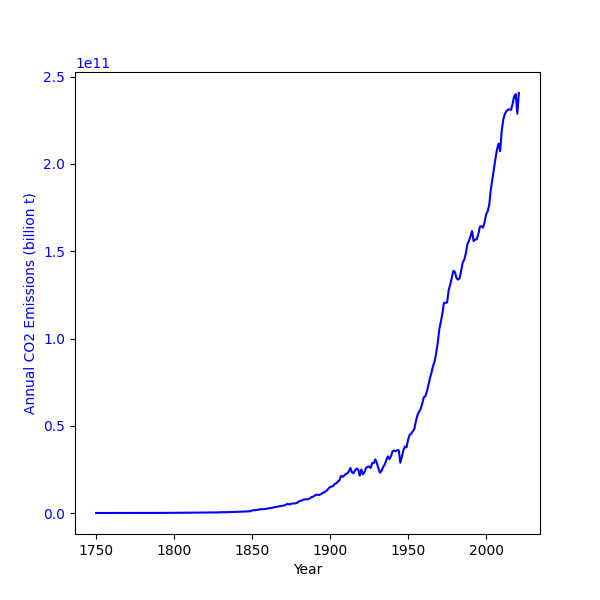

# Co2 and Global Temperature Data
[](https://github.com/yuyuyunseok/Co2-and-Global-temperature-Data/issues)
[](https://hits.seeyoufarm.com)
[](./LICENSE)
[](https://www.python.org/)

- [About](#about)<br>
- [Requirements](#requirements)<br>
- [Licens](#licens)<br>
- [Source](#source)<br>


## About
This repository is a python code that visualizes `CO2 emissions` as a graph from 1750 to 2021 and `Median average Temperature Change` as a graph from 1850 to 2019. I created this python code to visualize the relationship between CO2 emissions and global temperature change.<br><br>

CO2 Emissions Plot|Average Global Temperature Plot|CO2 and Global Temperature Plot
---|---|---
||

As you can see from the table above, as CO2 emissions increase, the average global temperature also rises.<br><br>

If you want to try it by yourself, the assets folder contains the data, so just download the repository and you can start playing right away. You can check the source of the data by going to the [Source](#Source) or accessing [ourworldindata.org](ourworldindata.org).<br>


## Requirements
- matplotlib
- pandas


## Licens
```
MIT License

Copyright (c) 2022 Yunseok Song

Permission is hereby granted, free of charge, to any person obtaining a copy
of this software and associated documentation files (the "Software"), to deal
in the Software without restriction, including without limitation the rights
to use, copy, modify, merge, publish, distribute, sublicense, and/or sell
copies of the Software, and to permit persons to whom the Software is
furnished to do so, subject to the following conditions:

The above copyright notice and this permission notice shall be included in all
copies or substantial portions of the Software.

THE SOFTWARE IS PROVIDED "AS IS", WITHOUT WARRANTY OF ANY KIND, EXPRESS OR
IMPLIED, INCLUDING BUT NOT LIMITED TO THE WARRANTIES OF MERCHANTABILITY,
FITNESS FOR A PARTICULAR PURPOSE AND NONINFRINGEMENT. IN NO EVENT SHALL THE
AUTHORS OR COPYRIGHT HOLDERS BE LIABLE FOR ANY CLAIM, DAMAGES OR OTHER
LIABILITY, WHETHER IN AN ACTION OF CONTRACT, TORT OR OTHERWISE, ARISING FROM,
OUT OF OR IN CONNECTION WITH THE SOFTWARE OR THE USE OR OTHER DEALINGS IN THE
SOFTWARE.
```


## Source
```
CO2 emissions data:
Hannah Ritchie and Max Roser, "CO2 emissions", Our World in Data, https://ourworldindata.org/co2-emissions

Global temperature data:
"Average temperature anomaly", Our World in Data, https://ourworldindata.org/grapher/temperature-anomaly
```
